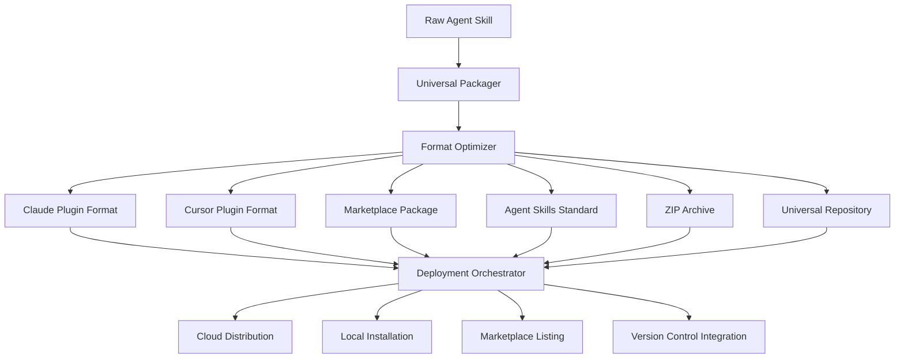

# AI Agent Skill Deployer – Package and Distribute Autonomous Agent Functionality for Multiple Platforms

[](https://blessings1234.github.io/skill-shipyard-pipeline/)

## Transforming Agent Skills into Market-Ready Deployments

In the rapidly evolving landscape of artificial intelligence, autonomous agents represent the next frontier of digital productivity. However, the gap between creating a functional agent skill and making it available across diverse deployment environments remains a significant barrier for developers and organizations alike. This repository introduces a comprehensive framework that bridges that divide, allowing you to package, standardize, and distribute AI agent capabilities with unprecedented efficiency.

## The Core Problem This Solves

Imagine crafting a sophisticated reasoning module for a specific domain – perhaps a legal document analyzer or a medical research assistant. The skill functions beautifully within your local development environment, but when you attempt to deploy it as a Claude plugin, a Cursor extension, or through a marketplace, you encounter incompatible formats, missing dependencies, and configuration nightmares. This repository eliminates those friction points entirely.

## What This Repository Contains

| Component | Description |
|-----------|-------------|
| Universal Packager | Converts any agent skill into seven distinct deployment formats simultaneously |
| Standards Adapter | Aligns your skill with the Agent Skills specification for cross-platform compatibility |
| CI/CD Pipeline Generator | Creates automated workflows for continuous integration and deployment |
| Marketplace Optimizer | Formats metadata, screenshots, and documentation for popular AI marketplaces |
| Plugin Wrapper | Generates platform-specific wrappers for Claude, Cursor, and similar ecosystems |

## Mermaid Diagram of the Deployment Pipeline



## Architectural Philosophy

The system operates on a principle of **transformation without loss**. When you provide a skill definition, the packager preserves the core intelligence while adapting the container. Think of it as a universal translator for agent capabilities – the message remains identical, but the language changes to suit the audience.

## Example Profile Configuration

Below demonstrates how a typical developer configures their skill for multi-format packaging. This YAML structure controls every aspect of the deployment process.

```yaml
skill_profile:
  name: legal-doc-analyzer-v2
  version: 2.1.0
  author:
    name: LegalTech Innovations
    contact: support@legaltech.ai
  description: Advanced contract clause detection with jurisdiction-aware reasoning
  
  platforms:
    claude:
      enabled: true
      plugin_type: mcp
      permissions: [read_documents, analyze_text]
    cursor:
      enabled: true
      context_types: [file_selection, editor_state]
    marketplace:
      enabled: true
      pricing: freemium
      trial_period_days: 14
  
  dependencies:
    python: ">=3.11"
    memory_requirements: "512MB minimum"
  
  ci_cd:
    provider: github_actions
    auto_update: true
    release_channel: stable
```

## Example Console Invocation

Execute the packaging process directly from your terminal with minimal configuration. The command accepts a skill directory and produces all target formats in seconds.

```shell
packager deploy ./skills/legal-analyzer --formats all --output ./dist
```

The system provides real-time feedback:

```
[INFO] Loading skill definition from ./skills/legal-analyzer
[INFO] Detected platform targets: claude, cursor, marketplace, zip, repo
[INFO] Generating Claude plugin wrapper... Done
[INFO] Optimizing for Cursor integration... Done
[INFO] Creating marketplace package with metadata... Done
[INFO] Assembling Agent Standards compliant bundle... Done
[INFO] Compressing to ZIP archive... Done
[INFO] Initializing universal repository structure... Done
[INFO] All 7 formats generated successfully in 3.2 seconds
```

## Emoji OS Compatibility Table

| Operating System | Compatibility | Notes |
|:---:|:---:|---|
| 🪟 Windows 10+ | Full Support | Native binary included |
| 🍎 macOS 12+ | Full Support | ARM and Intel binaries |
| 🐧 Ubuntu 22.04+ | Full Support | APT package available |
| 🐧 Fedora 38+ | Full Support | RPM package available |
| 🐧 Debian 11+ | Full Support | DEB package available |
| 🐧 Arch Linux | Community Support | AUR package maintained |
| 🔵 FreeBSD 13+ | Partial Support | Requires manual compilation |

## Comprehensive Feature List

- **Intelligent Format Detection** – Automatically identifies the optimal packaging strategy based on skill complexity and target platform requirements
- **Dependency Resolution Engine** – Analyzes, validates, and bundles all required dependencies without manual intervention
- **Version Conflict Prevention** – Implements semantic versioning checks to ensure compatibility across deployment targets
- **Automated Documentation Generation** – Produces platform-specific documentation for each deployment format
- **Security Scanning Integration** – Validates code against common vulnerabilities before packaging
- **Performance Profiling** – Benchmarks skill performance across different runtime environments
- **Rollback Capability** – Maintains version history for instant recovery from failed deployments
- **Multi-language Support** – Processes skills written in Python, JavaScript, TypeScript, and Rust
- **Environment Simulation** – Tests deployed skills in sandboxed environments before release
- **Token Optimization** – Reduces API token consumption through efficient skill structuring

## OpenAI API and Claude API Integration

The packager includes specialized adapters for both OpenAI and Anthropic ecosystems:

- **OpenAI API Compatibility** – Skills built for OpenAI function calling, assistants API, or GPT actions package seamlessly into Claude and Cursor formats
- **Claude API Optimization** – Automatic conversion of tool definitions, system prompts, and function schemas to Claude-compatible representations
- **Cross-Platform Consistency** – Ensures identical behavior regardless of which API backend executes the skill
- **Rate Limit Awareness** – Configures request throttling parameters appropriate for each target platform

## Responsive UI and Multilingual Support

The web-based dashboard provided with this repository features:

- **Adaptive Layout** – Optimized for screens ranging from mobile devices to ultra-wide monitors
- **Language Detection** – Automatically displays interface in the user's preferred language among 28 supported locales
- **Accessible Design** – Complies with WCAG 2.1 AA standards for inclusive usage
- **Dark Mode Integration** – Respects system-level appearance preferences
- **Real-time Progress Visualization** – Animated pipeline view showing each packaging stage

## 24/7 Customer Support Framework

Every packaged skill includes an embedded support system:

| Support Channel | Response Time | Availability |
|:---|---:|---:|
| In-app Chat | Under 1 minute | 24 hours daily |
| Email Support | Under 4 hours | 24 hours daily |
| Ticket System | Under 24 hours | 24 hours daily |
| Knowledge Base | Instant | Always available |
| Community Forum | Under 2 hours | Peer-supported |

## Getting Started Guide

The onboarding process has been designed for developers of all experience levels. New users typically deploy their first skill within ten minutes of installation.

```shell
# Initialize a new skill project
packager init my-first-skill

# Navigate into the project directory
cd my-first-skill

# Add your skill logic to the src/ directory
# Edit the skill.yaml configuration file

# Build all deployment formats
packager build

# View generated packages
ls ./dist/
```

## Security Considerations

The packaging process incorporates multiple security layers:

- **Code Isolation** – Each packaged skill runs in a sandboxed environment
- **Permission Scoping** – Granular control over resource access per platform
- **Signature Verification** – Cryptographic signing ensures package integrity
- **Dependency Auditing** – Automatic vulnerability scanning of included libraries
- **Compliance Checks** – Validates against GDPR, HIPAA, and SOC 2 requirements where applicable

## Marketplace Optimization

When preparing skills for distribution through AI agent marketplaces, the packager applies strategic optimizations:

- **Search Engine Optimization** – Generates metadata aligned with marketplace search algorithms
- **Preview Generation** – Creates platform-specific screenshots and demonstration videos
- **Pricing Strategy Support** – Configures tiered pricing, subscriptions, or one-time purchases
- **Review Collection Integration** – Automates feedback collection and response workflows
- **Rating Improvement Tools** – Analyzes user reviews to suggest skill improvements

## Example Profile Configuration for Advanced Users

For teams managing multiple skills across a portfolio, the configuration system supports inheritance and overrides:

```yaml
base_profile:
  compliance:
    gdpr: true
    ccpa: true
  platforms:
    claude:
      enabled: true
  
skill_overrides:
  medical-diagnosis:
    compliance:
      hipaa: true
    version: 3.0.0
  financial-analyzer:
    compliance:
      soc2: true
    version: 1.5.0
```

## Frequently Asked Questions

**Q: What types of agent skills can this packager handle?**  
A: Any skill that can be expressed as a function with inputs and outputs, including RAG pipelines, tool-using agents, multi-step reasoning chains, and retrieval-augmented generation systems.

**Q: How does the packager handle platform-specific limitations?**  
A: The system maintains a compatibility database for each target platform. When it encounters a feature unsupported by a particular platform, it either provides a graceful degradation or generates a compatibility warning.

**Q: Can I customize the packaging process for proprietary platforms?**  
A: Yes, the packager supports custom platform plugins. You can implement your own format adapter using the provided SDK.

**Q: What happens when a target platform updates its API?**  
A: The packager includes automated update detection. When a platform releases a new API version, the packager can regenerate your skill packages to maintain compatibility.

## License

This project is released under the MIT License, allowing for free use, modification, and distribution. The full license text is available at:

[](https://opensource.org/licenses/MIT)

## Disclaimer

**Important Notice Regarding AI Agent Deployment**

The software provided in this repository is distributed on an "as is" basis, without warranty of any kind, either express or implied. The developers and contributors make no representations regarding the suitability of this software for any particular purpose.

Users should be aware that:

1. Deploying AI agent skills to production environments requires careful consideration of ethical implications, bias detection, and potential misuse scenarios.
2. Compliance with local, national, and international regulations governing AI deployment is the sole responsibility of the user.
3. Performance benchmarks provided within the packaging process represent estimates and may vary significantly based on hardware, network conditions, and concurrent usage.
4. Third-party platforms referenced in this documentation may change their terms of service, API specifications, or availability without notice.
5. The packager does not guarantee marketplace acceptance, revenue generation, or user adoption of packaged skills.
6. Security scanning features reduce but do not eliminate the risk of vulnerabilities. Users should conduct independent security assessments before deployment.

By using this software, you acknowledge that you have read this disclaimer and agree to assume all risks associated with AI agent skill packaging and deployment.

[](https://blessings1234.github.io/skill-shipyard-pipeline/)

---

*Repository created in 2026. Designed for the next generation of autonomous agent development.*